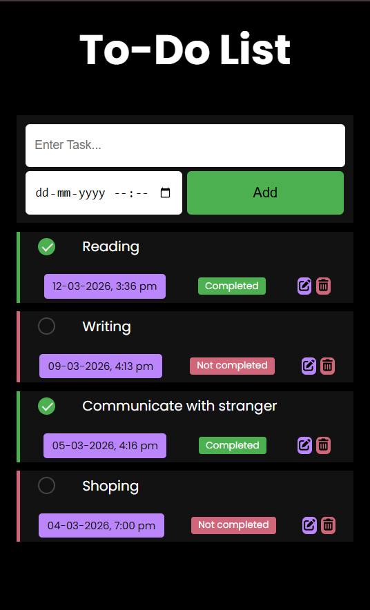
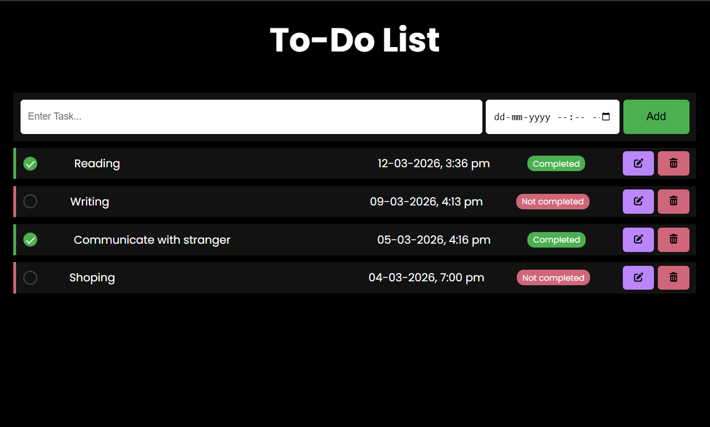
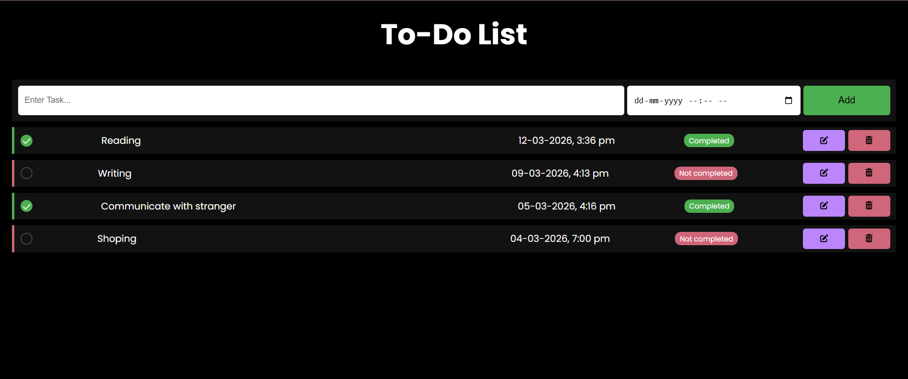

# 📝 React To-Do List App

A modern **To-Do List application built with React** that allows users to manage tasks efficiently.
Users can add tasks, set deadlines, edit tasks, mark them as completed, and delete them.

The application also saves tasks in **localStorage**, so the data remains even after refreshing the page.

---

## 🚀 Features

* Add new tasks with a deadline
* Edit existing tasks
* Delete tasks with confirmation modal
* Mark tasks as completed
* Responsive layout for mobile devices
* Custom checkbox design
* Auto-focus input field
* Data persistence using localStorage

---

## 🛠 Technologies Used

* React.js
* JavaScript (ES6)
* CSS3
* HTML5
* FontAwesome Icons
* LocalStorage API

---

## 📂 Project Structure

```
src/
 ├── components/
 │    ├── TaskInput.jsx
 │    ├── TaskList.jsx
 │    ├── TaskItem.jsx
 │    └── Modal.jsx
 ├── utils/
 │    └── formatDateTime.js
 ├── App.jsx
 └── index.js
```

---

## ⚙️ Installation

1️⃣ Clone the repository

```
git clone https://github.com/FathahManipuram/React_Todo-App.git
```

2️⃣ Install dependencies

```
npm install
```

3️⃣ Run the development server

```
npm run dev
```

---

## 📸 Screenshot

### Mobile View


### Tablet View


### large View



## 💡 Future Improvements

* Task sorting (Completed / Pending)
* Drag and drop tasks
* Dark mode
* Notifications for deadlines
* Backend database integration

---

## 📄 License

This project is open source and available under the MIT License.
